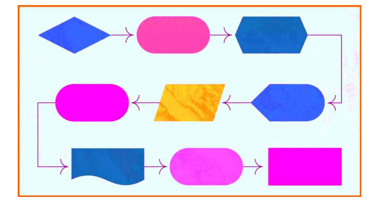

### Documentación de la Aplicación de Gestión Veterinaria
___
[Documentación de la aplicacion de gestion veterinaria](https://google.com)

**esto esta en negrita**

`1.Haz un fork del repositorio`
`2.Haz un fork del repositorio`
`3.Haz un fork del repositorio`
`4.Haz un fork del repositorio`
|Modulos de primero | modulos de segundo|
|-------------------|-------------------|
|programacion|desarrollo|
|entornos|cliente|

